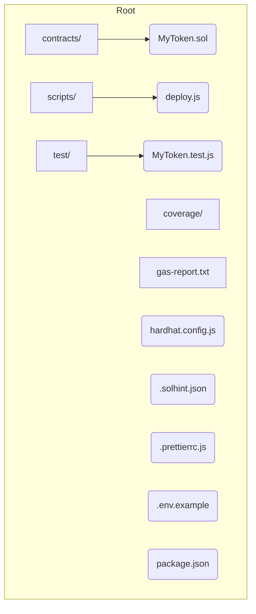
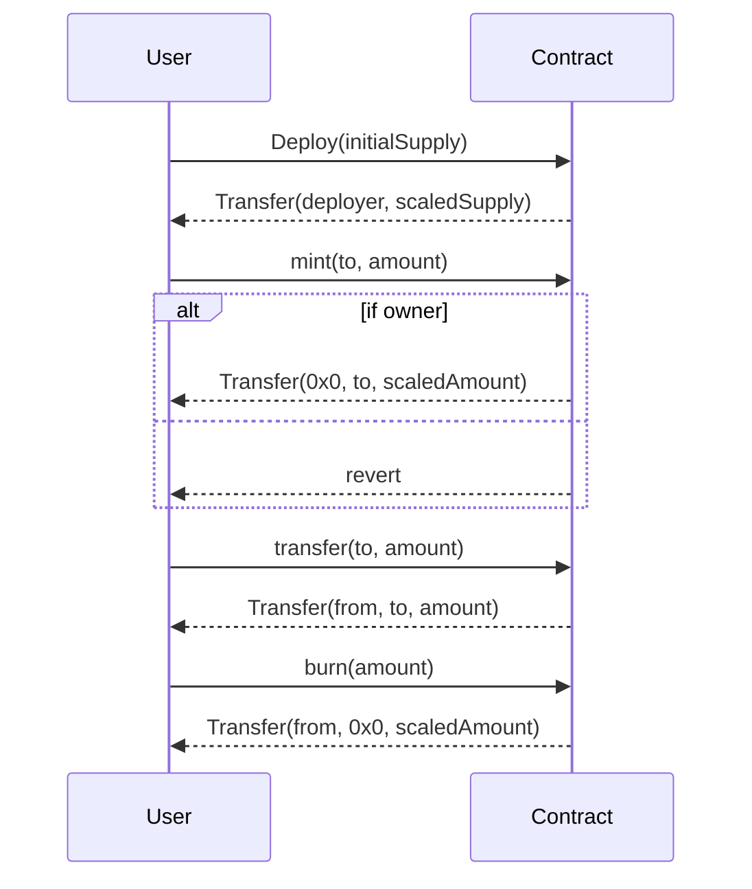

# ERC20 Token Hardhat

A minimal Hardhat boilerplate for an ERC20 token contract, featuring compilation, testing, gas reporting, coverage, and Etherscan verification.

---

## 📋 Table of Contents

* [Features](#features)
* [Prerequisites](#prerequisites)
* [Getting Started](#getting-started)
* [Usage](#usage)
* [Project Structure](#project-structure)
* [Operation Flow](#operation-flow)
* [Troubleshooting](#troubleshooting)
* [Contributing](#contributing)
* [License](#license)

---

## 🔥 Features

1. **ERC20 Contract**

   * `MyToken.sol` extends OpenZeppelin’s ERC20 & Ownable
   * Constructor mints initial supply (scaled by decimals)
   * Owner-only `mint` and public `burn`
2. **Local Testing**

   * Hardhat + Mocha/Chai + Waffle matchers
   * Automated tests for mint, burn, transfer, and edge cases
3. **Gas Reporting**

   * `hardhat-gas-reporter` integration
   * Generates `gas-report.txt`
4. **Coverage**

   * `solidity-coverage` plugin
   * Generates `coverage/` HTML report
5. **Lint & Format**

   * `solhint` static analysis & auto-fix
   * Prettier with `prettier-plugin-solidity`
6. **Deployment & Verification**

   * Hardhat scripts for Local, Goerli, and Sepolia
   * Etherscan source verification
7. **CI**

   * GitHub Actions for lint, test, and coverage

---

## ⚙️ Prerequisites

* Node.js v16+ & npm
* Git
* An Ethereum wallet private key (for testnets)
* Infura/Alchemy project ID or equivalent RPC endpoint
* Etherscan API key
* (Optional) CoinMarketCap API key for gas price reporting

---

## 🚀 Getting Started

1. **Clone & Install**

   ```bash
   git clone https://github.com/Alexintw/erc20-token.git
   cd erc20-token
   npm install
   ```

2. **Configure .env**

   ```bash
   cp .env.example .env
   ```

   Fill in `.env`:

   ```ini
   GOERLI_RPC_URL=https://goerli.infura.io/v3/YOUR_PROJECT_ID
   SEPOLIA_RPC_URL=https://sepolia.infura.io/v3/YOUR_PROJECT_ID
   PRIVATE_KEY=0xYOUR_PRIVATE_KEY
   ETHERSCAN_API_KEY=YOUR_ETHERSCAN_KEY
   COINMARKETCAP_API_KEY=YOUR_COINMARKETCAP_KEY  # optional
   ```

---

## 💻 Usage

```bash
# Compile contracts
npm run compile

# Run tests
npm run test

# Generate gas report
npm run gas

# Generate coverage report
npm run coverage

# Lint code
npm run lint

# Format code
npm run format

# Deploy to local network
npm run deploy:localhost

# Deploy to Goerli
npm run deploy:goerli

# Verify on Etherscan
npm run verify:goerli -- <DEPLOYED_ADDRESS> <INITIAL_SUPPLY>
```

---

## 🗂️ Project Structure



*Contracts: Solidity source files*
*Scripts: Deployment scripts*
*Test: Automated tests*
*Coverage & Gas: Reports*
*Config & Env: Tooling & keys*

---

## 🔄 Operation Flow



---

## ❓ Troubleshooting

* **Network Unreachable**: Verify RPC URL and DNS resolution.
* **Invalid Private Key**: Must be `0x` + 64 hex characters.
* **Version Mismatch**: Align Solidity version in `hardhat.config.js` with contracts.

---

## 🤝 Contributing

1. Fork this repo
2. Create your feature branch
3. Commit your changes
4. Open a Pull Request
5. Ensure CI passes

---

## 📄 License

MIT © Alex Ko
